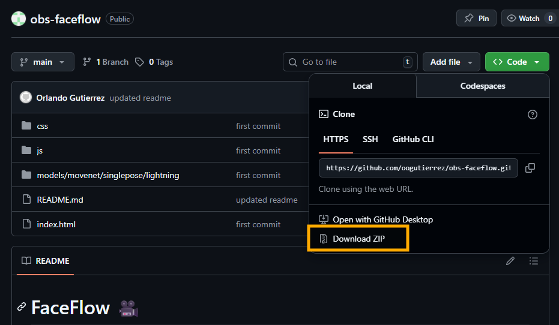
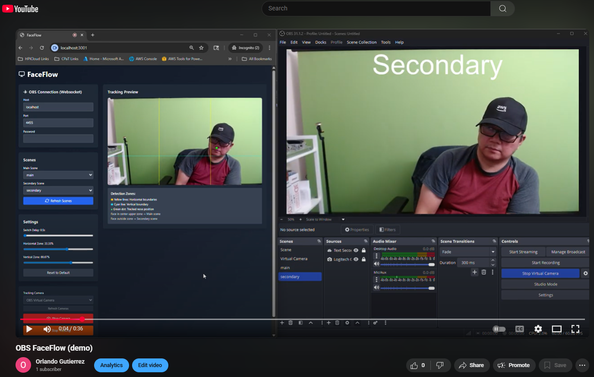

# FaceFlow 🎥  
**Automatic Scene Switching for OBS based on Face Tracking**

FaceFlow is a lightweight browser-based tool that automatically switches between a **Main Scene** and a **Secondary Scene** in OBS Studio — depending on the location of a person detected through a tracking camera.  
Ideal for streamers, presenters, and content creators who want hands-free, intelligent scene control.

---

## 🚀 Features
- 🎯 **Real-Time Tracking** — Detects a person’s position using your webcam  
- 🔄 **Automatic Scene Switching** — Seamlessly toggles between scenes in OBS  
- ⚙️ **Customizable Settings** — Adjust tracking sensitivity and transition rules  
- 🌐 **Local Web App** — Runs directly in your browser with no installation required  
- 🔒 **Secure Integration** — Works with OBS WebSocket (with or without authentication)  

---

## 🧰 Requirements

Before starting, make sure you have the following:

1. **OBS Studio** installed  
2. **OBS WebSocket** plugin (built into OBS 28+ or installed manually if using an older version)  
3. **Python 3.x** installed on your computer  

---

## ⚙️ Setup Instructions

### 1. Enable OBS WebSocket
In OBS Studio:
1. Go to **Tools → WebSocket Server Settings**  
2. Check ✅ **Enable WebSocket Server**  
3. If **Enable Authentication** is checked:
   - Click **Show Connect Info** and copy the **Server Password**
   - You’ll need this password later  
   *(Alternatively, you can uncheck "Enable Authentication" for easier setup.)*

(Optional): Setup and **Start Virtual Camera** in OBS.  
This is especially useful if you want to use the same camera that is already in use by OBS.

---

### 2. Download and extract the files of this project
In the main branch of this github repo, click **<> Code** then **Download Zip**


Extract the downloaded zip file.

---

### 3. Start Local Server

Open your terminal or command line and cd to the project directory where you can find the index.html file.

Run the following command in your project directory:

```bash
python -m http.server 3001 --bind 127.0.0.1
```

This launches a lightweight local web server at **http://127.0.0.1:3001**.

---

### 4. Allow Camera Access
When prompted by your browser:
- Allow access to your **camera**
- Select the camera you’ll use for **tracking**

---

### 5. Connect to OBS
Once the interface loads:

1. Enter the **WebSocket password** from OBS (if authentication is enabled)  
2. Click **Refresh Scenes**  
3. Choose your **Main Scene** and **Secondary Scene** from the dropdown menus  

---

### 6. Start Tracking
1. Under **Tracking Camera**, click **Start Camera**  
2. Adjust **Settings** as desired (e.g., switch delay, zones)  
3. Click **Start Tracking** to begin automatic switching between scenes  

---

## 🧠 How It Works
- The tracking camera monitors your face’s position in real time  
- If you move outside a defined boundary or zone, FaceFlow automatically tells OBS (via WebSocket) to switch to the **Secondary Scene**  
- When you return to the main zone, it switches back to the **Main Scene**  
- You can fine-tune the behavior in the **Settings** panel  
- [Watch the video](https://www.youtube.com/watch?v=bG6ang9wR6k)  
[](https://www.youtube.com/watch?v=bG6ang9wR6k)

---

## 🧩 Troubleshooting

**OBS not connecting?**
- Ensure OBS is running and the WebSocket server is enabled  
- Double-check the WebSocket **port** and **password**  
- Verify that no firewall or antivirus is blocking the connection  

**Camera not detected?**
- Make sure no other application is using the same camera, or choose an OBS Virtual Camera  
- Try refreshing the page or restarting the local server  

**Scenes not showing up?**
- Click **Refresh Scenes** again after connecting  
- Ensure OBS is open and active before running FaceFlow  

---

## 🧪 Tips & Best Practices
- Use a well-lit environment for optimal tracking accuracy  
- Keep your camera steady — avoid sudden movements of the device itself  
- You can stop tracking anytime by clicking **Stop Tracking**  
- Test your setup with simple scenes first before going live  

---

## 🧾 Example Command Summary
```bash
# Start local web server
python -m http.server 3001 --bind 127.0.0.1

# Open in your browser
http://127.0.0.1:3001
```

---

## 📄 License
This project is licensed under the **MIT License**.  
You are free to use, modify, and distribute this software with attribution.

---

## 💡 Credits
Developed with ❤️ by **Orlando Gutierrez**.  
If you find this project useful and would like to consider [donating via PayPal](https://paypal.me/oogutierrezpaypal).  

Powered by:
- [OBS WebSocket](https://github.com/obsproject/obs-websocket)  
- Modern Browser APIs (WebRTC, WebSocket, MediaDevices)

---

## ⚡ Quick Start (TL;DR)
1. Enable WebSocket in OBS  
2. Run  
   ```bash
   python -m http.server 3001 --bind 127.0.0.1
   ```  
3. Open browser → Allow camera → Connect to OBS  
4. Select **Main** and **Secondary** scenes  
5. Click **Start Tracking** 🎬

---

> ✨ *FaceFlow makes your production flow naturally — focus on your performance, not your OBS controls.*
